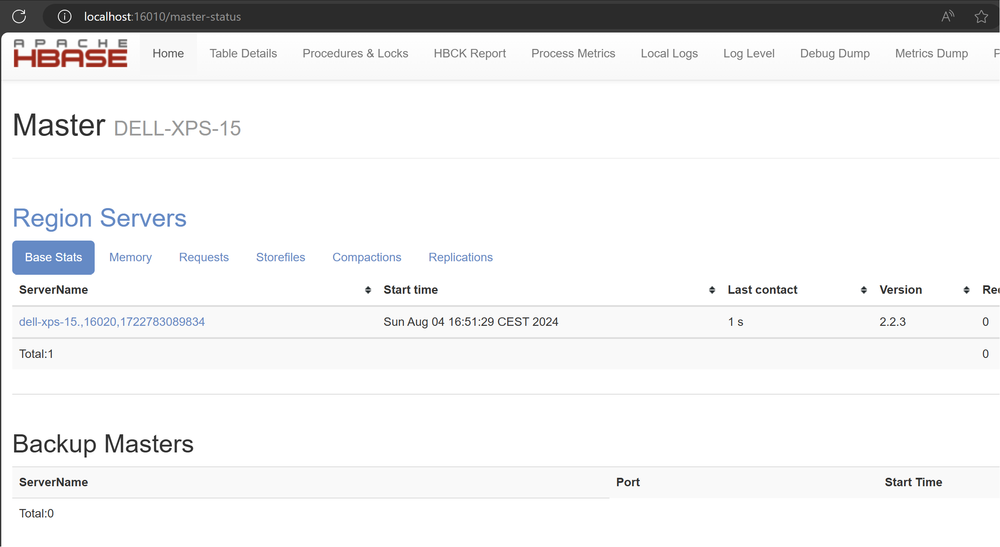

# HBase Phoenix Exporter

This repo contains an example how to export data from Apache HBase with Apache Phoenix as the SQL layer.
It uses a Hadoop MapReduce job and the provided `PhoenixInputFormat` class to read the data from the Phoenix tables and then writes to Parquet formatted files via the `ParquetOutputFormat`.

## Building

The project is based on Java and uses Maven to compile and package the code.
It requires the `mvn` CLI tool to be available and working.
Assuming the code is checked out into the `$PROJECT_HOME` directory, the following commands will compile the code and build the MapReduce job JAR:

```sh
$ cd $PROJECT_HOME
$ mvn compile package
[INFO] Scanning for projects...
[INFO]
[INFO] ----< com.databricks.fe.tools.hbase:phoenix-exporter-mapreduce-job >----
[INFO] Building Phoenix Exporter MapReduce Job 1.0-SNAPSHOT
[INFO] --------------------------------[ jar ]---------------------------------
...
[INFO] --- maven-jar-plugin:2.4:jar (default-jar) @ phoenix-exporter-mapreduce-job ---
[INFO] Building jar: /home/larsg/projects/work/databricks/phoenix-exporter/mrjob/target/phoenix-exporter-mapreduce-job-1.0-SNAPSHOT.jar
[INFO]
[INFO] --- maven-assembly-plugin:3.3.0:single (default) @ phoenix-exporter-mapreduce-job ---
...
[INFO] Building jar: /home/larsg/projects/work/databricks/phoenix-exporter/mrjob/target/phoenix-exporter-mapreduce-job-1.0-SNAPSHOT-jar-with-dependencies.jar
[INFO] ------------------------------------------------------------------------
[INFO] BUILD SUCCESS
[INFO] ------------------------------------------------------------------------
[INFO] Total time:  45.435 s
[INFO] Finished at: 2024-08-04T15:49:59+02:00
[INFO] ------------------------------------------------------------------------
```

After completing successfully, there are two JAR files in the default `./target` directory:

- `phoenix-exporter-mapreduce-job-1.0-SNAPSHOT.jar` - This JAR only contains the classes produced by compiling the code of this project.
- `phoenix-exporter-mapreduce-job-1.0-SNAPSHOT-jar-with-dependencies.jar` - This JAR contains the compiled classes as well as all required classes of all dependencies (as per the `pom.xml` file).

## Test Setup

The job JARs can be tested locally by setting up a local HBase version, along with Phoenix and Hadoop.

**Note:** It is highly recommended to use a Linux OS for the setup.
MacOS is not recommended as it causes many issues, such as erroneously reporting duplicate `LICENSE` files in the job JAR due to file naming casing differences, and `UnresolvedAddressException` being thrown when connecting to the local Zookeeper port.
While some of these can be worked around, the results are still questionable.

Create local directory and a data directory inside:

```sh
$ cd ~
$ mkdir phoenix-exporter
$ cd phoenix-exporter
$ mkdir .data
```

Get the tarballs, here some older versions matching closely enough what is used in CDH 7.1.1:

```sh
$ wget https://archive.apache.org/dist/hbase/2.2.3/hbase-2.2.3-bin.tar.gz
$ wget https://archive.apache.org/dist/hadoop/common/hadoop-3.1.1/hadoop-3.1.1.tar.gz
$ wget https://archive.apache.org/dist/phoenix/phoenix-5.1.0/phoenix-hbase-2.2-5.1.0-bin.tar.gz
```

Unpack everything:

```sh
$ tar -zxvf hbase-2.2.3-bin.tar.gz
$ tar -zxvf hadoop-3.1.1.tar.gz
$ tar -zxvf phoenix-hbase-2.2-5.1.0-bin.tar.gz
```

### HBase Setup

Configure HBase:

**Note:** Set the `JAVA_HOME` variable to a local Java JDK installation and set the `<user_name>` accordingly.

```sh
$ cd hbase-2.2.3/
$ vi conf/hbase-env.sh
...
# The java implementation to use.  Java 1.8+ required.
# export JAVA_HOME=/usr/java/jdk1.8.0/
export JAVA_HOME=/usr/lib/jvm/java-11-openjdk-amd64/

# Extra Java CLASSPATH elements.  Optional.
# export HBASE_CLASSPATH=
export HBASE_CLASSPATH=/home/<user_name>/phoenix-exporter/phoenix-hbase-2.2-5.1.0-bin/phoenix-server-hbase-2.2-5.1.0.jar

$ vi conf/hbase-site.xml
...
<configuration>
  <property>
    <name>hbase.cluster.distributed</name>
    <value>false</value>
  </property>
  <property>
    <name>hbase.tmp.dir</name>
    <value>/home/<user_name>/phoenix-exporter/.data/tmp</value>
  </property>
  <property>
    <name>hbase.unsafe.stream.capability.enforce</name>
    <value>false</value>
  </property>
  <property>
    <name>hbase.rootdir</name>
    <value>file:///home/<user_name>/phoenix-exporter/.data/hbase</value>
  </property>
  <property>
    <name>dfs.replication</name>
    <value>1</value>
  </property>
  <property>
    <name>hbase.zookeeper.property.clientPortAddress</name>
    <value>0.0.0.0</value>
  </property>
</configuration>
```

Start HBase and verify it is operational by opening the HBase Master UI:

```sh
$ bin/stop-hbase.sh && bin/start-hbase.sh
$ open http://localhost:16010
```



### Phoenix CLI

Since Phoenix is running inside of HBase, it suffices to connect to the local HBase instance using the Phoenix CLI to trigger the installation of all coprocessors:

```sh
$ cd ..
$ cd phoenix-hbase-2.2-5.1.0-bin/
$ bin/sqlline.py
...
sqlline version 1.9.0
0: jdbc:phoenix:>
```

### MapReduce Setup

Configure MapReduce to run as local jobs, which means no Hadoop daemons need to run at all.

**Note:** Set the `JAVA_HOME` variable to a local Java JDK installation.

```sh
$ cd hadoop-3.1.1/
$ vi etc/hadoop/hadoop-env.sh
...
# The java implementation to use. By default, this environment
# variable is REQUIRED on ALL platforms except OS X!
# export JAVA_HOME=
export JAVA_HOME=/usr/lib/jvm/java-11-openjdk-amd64/
...

$ vi etc/hadoop/core-site.xml
<configuration>
  <property>
    <name>fs.defaultFS</name>
    <value>file:///</value>
  </property>
</configuration>

$ vi etc/hadoop/mapred-site.xml
<configuration>
  <property>
    <name>mapreduce.framework.name</name>
    <value>local</value>
  </property>
</configuration>
```

Test with a provided MapReduce job example:

```sh
$ bin/hadoop jar share/hadoop/mapreduce/hadoop-mapreduce-examples-3.1.1.jar wordcount README.txt /tmp/wc1
...
$ head /tmp/wc1/part-r-00000
(BIS),  1
(ECCN)  1
(TSU)   1
(see    1
5D002.C.1,      1
740.13) 1
<http://www.wassenaar.org/>     1
Administration  1
Apache  1
BEFORE  1
```

### Create Test Data

The repo contains a small Phoenix example that creates a basic table and inserts (that is, upsert) two rows:

```sh
$ cd $PROJECT_HOME
$ mvn compile exec:java -Dexec.mainClass="com.databricks.fe.tools.hbase.PhoenixJdbcExample"
...
Before Connection....
...
Connection created....
Statement created....
2024-08-04 18:28:52,077 INFO  [com.databricks.fe.tools.hbase.PhoenixJdbcExample.main()] client.HBaseAdmin (HBaseAdmin.java:postOperationResult(3608)) - Operation: CREATE, Table Name: default:JAVATEST, procId: 124 completed
Table Values
        Row: 1 = Hello
        Row: 2 = Java Application
...
```

In the HBase Shell the resulting HBase looks like this: 

```
hbase(main):001:0> scan "JAVATEST"
ROW                                COLUMN+CELL
 \x80\x00\x00\x01                  column=0:\x00\x00\x00\x00, timestamp=1722788932263, value=x
 \x80\x00\x00\x01                  column=0:\x80\x0B, timestamp=1722788932263, value=Hello
 \x80\x00\x00\x02                  column=0:\x00\x00\x00\x00, timestamp=1722788932325, value=x
 \x80\x00\x00\x02                  column=0:\x80\x0B, timestamp=1722788932325, value=Java Application
2 row(s)
Took 0.0591 seconds
hbase(main):019:0>
```

## Run MapReduce Job

After setting everything up, the final step is running the MapReduce job to export the data as Parquet files:

```sh
$ bin/hadoop jar $PROJECT_HOME/target/phoenix-exporter-mapreduce-job-1.0-SNAPSHOT-jar-with-dependencies.jar JAVATEST /tmp/jt1
...
024-08-04 18:38:16,689 INFO hbase.PhoenixToParquetJob: Determined schema: {"type":"record","name":"row","fields":[{"name":"MYKEY","type":"int"},{"name":"MYCOLUMN","type":"string"}]}
...
2024-08-04 18:38:17,427 INFO util.PhoenixConfigurationUtil: Select Statement: SELECT "MYKEY" , "0"."MYCOLUMN" FROM JAVATEST
...
2024-08-04 18:38:17,801 INFO mapred.LocalJobRunner: OutputCommitter is org.apache.parquet.hadoop.ParquetOutputCommitter
2024-08-04 18:38:17,825 INFO mapred.LocalJobRunner: Waiting for map tasks
2024-08-04 18:38:17,826 INFO mapred.LocalJobRunner: Starting task: attempt_local241457283_0001_m_000000_0
2024-08-04 18:38:17,843 INFO output.FileOutputCommitter: File Output Committer Algorithm version is 2
2024-08-04 18:38:17,843 INFO output.FileOutputCommitter: FileOutputCommitter skip cleanup _temporary folders under output directory:false, ignore cleanup failures: false
...
2024-08-04 18:38:18,125 INFO hbase.PhoenixToParquetMapper: Record: {"MYKEY": 1, "MYCOLUMN": "Hello"}
2024-08-04 18:38:18,127 INFO hbase.PhoenixToParquetMapper: Record: {"MYKEY": 2, "MYCOLUMN": "Java Application"}
2024-08-04 18:38:18,129 INFO mapred.LocalJobRunner: 
...
2024-08-04 18:38:18,222 INFO output.FileOutputCommitter: Saved output of task 'attempt_local241457283_0001_m_000000_0' to file:/tmp/jt16
2024-08-04 18:38:18,224 INFO mapred.LocalJobRunner: map
2024-08-04 18:38:18,224 INFO mapred.Task: Task 'attempt_local241457283_0001_m_000000_0' done.
2024-08-04 18:38:18,230 INFO mapred.Task: Final Counters for attempt_local241457283_0001_m_000000_0: Counters: 15
        File System Counters
                FILE: Number of bytes read=251917921
                FILE: Number of bytes written=254464792
                FILE: Number of read operations=0
                FILE: Number of large read operations=0
                FILE: Number of write operations=0
        Map-Reduce Framework
                Map input records=2
                Map output records=2
                Input split bytes=453
                Spilled Records=0
                Failed Shuffles=0
                Merged Map outputs=0
                GC time elapsed (ms)=69
                Total committed heap usage (bytes)=506462208
        File Input Format Counters 
                Bytes Read=0
        File Output Format Counters 
                Bytes Written=514
...
2024-08-04 18:38:18,799 INFO mapreduce.Job:  map 100% reduce 0%
2024-08-04 18:38:18,801 INFO mapreduce.Job: Job job_local241457283_0001 completed successfully
2024-08-04 18:38:18,808 INFO mapreduce.Job: Counters: 15
        File System Counters
                FILE: Number of bytes read=251917921
                FILE: Number of bytes written=254464792
                FILE: Number of read operations=0
                FILE: Number of large read operations=0
                FILE: Number of write operations=0
        Map-Reduce Framework
                Map input records=2
                Map output records=2
                Input split bytes=453
                Spilled Records=0
                Failed Shuffles=0
                Merged Map outputs=0
                GC time elapsed (ms)=69
                Total committed heap usage (bytes)=506462208
        File Input Format Counters 
                Bytes Read=0
        File Output Format Counters 
                Bytes Written=514
...
```

The result can be verified with the Parquet Tool:

```sh
$ cd ~/phoenix-exporter/
$ wget https://repo1.maven.org/maven2/org/apache/parquet/parquet-tools/1.11.2/parquet-tools-1.11.2.jar
$ cd ~/phoenix-exporter/hadoop-3.1.1
$ bin/hadoop jar ../parquet-tools-1.11.2.jar dump /tmp/jt1/part-m-00000.snappy.parquet 
row group 0 
--------------------------------------------------------------------------------
MYKEY:     INT32 SNAPPY DO:0 FPO:4 SZ:43/41/0.95 VC:2 ENC:BIT_PACKED,PLAIN [more]...
MYCOLUMN:  BINARY SNAPPY DO:0 FPO:47 SZ:77/75/0.97 VC:2 ENC:BIT_PACKED,PLAIN [more]...

    MYKEY TV=2 RL=0 DL=0
    ----------------------------------------------------------------------------
    page 0:  DLE:BIT_PACKED RLE:BIT_PACKED VLE:PLAIN ST:[min: 1, max:  [more]... SZ:8

    MYCOLUMN TV=2 RL=0 DL=0
    ----------------------------------------------------------------------------
    page 0:  DLE:BIT_PACKED RLE:BIT_PACKED VLE:PLAIN ST:[num_nulls: 0, [more]... SZ:29
...
INT32 MYKEY 
--------------------------------------------------------------------------------
*** row group 1 of 1, values 1 to 2 *** 
value 1: R:0 D:0 V:1
value 2: R:0 D:0 V:2

BINARY MYCOLUMN 
--------------------------------------------------------------------------------
*** row group 1 of 1, values 1 to 2 *** 
value 1: R:0 D:0 V:Hello
value 2: R:0 D:0 V:Java Application

$ bin/hadoop jar ../parquet-tools-1.11.2.jar schema /tmp/jt1/part-m-00000.snappy.parquet 
message row {
  required int32 MYKEY;
  required binary MYCOLUMN (STRING);
}
```